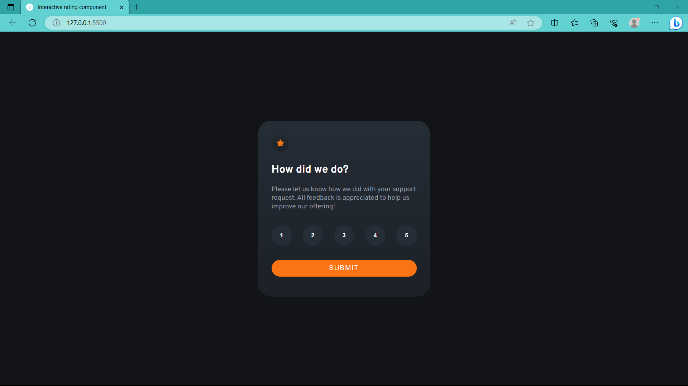

# Frontend Mentor - Interactive rating component

This is a solution to the [Interactive rating component challenge on Frontend Mentor](https://www.frontendmentor.io/challenges/interactive-rating-component-koxpeBUmI). 

## Table of contents

- [Overview](#overview)
  - [Screenshot](#screenshot)
  - [Links](#links)
- [My process](#my-process)
  - [Built with](#built-with)
  - [What I learned](#what-i-learned)
  - [Useful resources](#useful-resources)
- [Author](#author)

## Overview

### Screenshot

### Links

- Solution URL:  [Link](https://github.com/TJ-Shubham/Interactive-rating-component)
- Live Site URL: [Link](https://tj-shubham.github.io/Interactive-rating-component/)

## My process

### Built with

- Semantic HTML5 markup
- CSS custom properties
- Flexbox
- Used media query
- JS DOM

### What I learned

Learn DOM manipulation. Also learn customizing gradient property.

### Useful resources

- [EventListener](https://developer.mozilla.org/en-US/docs/Learn/JavaScript/Building_blocks/Events) - This helped me for adding event listener. I really liked this pattern and will use it going forward.
- Learn Instance methods [add()](https://developer.mozilla.org/en-US/docs/Web/API/DOMTokenList/add) and [remove()](https://developer.mozilla.org/en-US/docs/Web/API/DOMTokenList/remove)
- [setTimeout](https://developer.mozilla.org/en-US/docs/Web/API/setTimeout ) - This is an amazing article which helped me how to work with setTimeout function. I'd recommend it to anyone still learning this concept.

## Author

- Website - [Shubham](https://github.com/TJ-Shubham)
